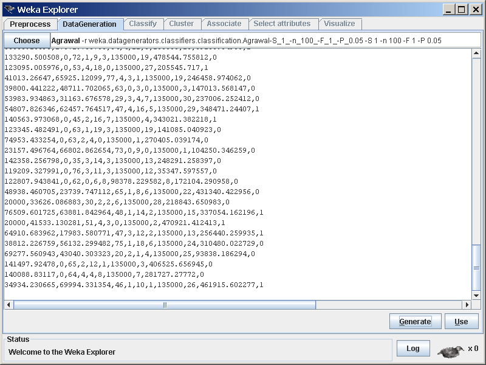
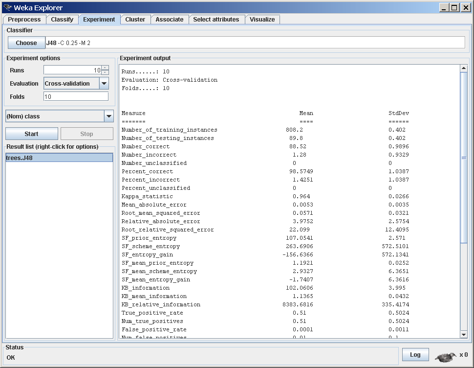

# Description
This article explains how to add extra tabs in the Explorer in order to add new functionality without the hassle of having to dig into the Explorer code oneself. With the new plugin-architecture of the Explorer it is fairly easy making your extensions available in the GUI.

**Note:** This is also covered in chapter *Extending WEKA* of the WEKA manual in versions later than 3.6.1/3.7.0 or [snapshots](snapshots.md) of the stable-3.6/developer version later than 10/01/2010.

# Version
>3.5.5 or [Snapshot](snapshots.md)

# Requirements
Here is roughly what is required in order to add a new tab (the examples go into more detail):

* your class must be derived from `javax.swing.JPanel`
* your class must implemented the interface `weka.gui.explorer.Explorer.ExplorerPanel`
* optional interfaces
	* `weka.gui.explorer.Explorer.LogHandler`
	>> in case you want to take advantage of the logging in the Explorer
	* `weka.gui.explorer.Explorer.CapabilitiesFilterChangeListener`
	>> in case your class needs to be notified of changes in the Capabilities, e.g., if new data is loaded into the Explorer
* adding the classname of your class to the *Tabs* property in the `Explorer.props` file

# Examples
The following examples demonstrate the new plugin architecture (a bold term for such a simple extension mechanism). Only the necessary details are discussed, as the full source code is available for download as well.

## SQL worksheet
### Purpose
Displaying the **SqlViewer** as a tab in the Explorer instead of using it either via the *Open DB...* button or as standalone application. Uses the existing components already available in Weka and just assembles them in a `JPanel`. Since this tab does not rely on a dataset being loaded into the Explorer, it will be used as a  *standalone* one.

Useful for people who are working a lot with databases and would like to have an SQL worksheet available all the time instead of clicking on a button every time to open up a database dialog.

### Implementation
* class is derived from `javax.swing.JPanel` and implements the `weka.gui.explorer.Explorer.ExplorerPanel` interface (the full source code also imports the `weka.gui.explorer.Explorer.LogHandler` interface, but that is only additional functionality):

```java
 public class SqlPanel
   extends JPanel
   implements ExplorerPanel {
```
* some basic members that we need to have
```java
  /** the parent frame */
  protected Explorer m_Explorer = null;
  
  /** sends notifications when the set of working instances gets changed*/
  protected PropertyChangeSupport m_Support = new PropertyChangeSupport(this);
```
* methods we need to implement due to the used interfaces
```java
  /** Sets the Explorer to use as parent frame */
  public void setExplorer(Explorer parent) {
    m_Explorer = parent;
  }
  
  /** returns the parent Explorer frame */
  public Explorer getExplorer() {
    return m_Explorer;
  }
  
  /** Returns the title for the tab in the Explorer */
  public String getTabTitle() {
    return "SQL";  * what's displayed as tab-title, e.g., *Classify//
  }
  
  /** Returns the tooltip for the tab in the Explorer */
  public String getTabTitleToolTip() {
    return "Retrieving data from databases";  // the tooltip of the tab
  }
  
  /** ignored, since we *"generate"* data and not receive it */
  public void setInstances(Instances inst) {
  }
  
  /** PropertyChangeListener who will be notified of value changes. */
  public void addPropertyChangeListener(PropertyChangeListener l) {
    m_Support.addPropertyChangeListener(l);
  }
  
  /** Removes a PropertyChangeListener. */
  public void removePropertyChangeListener(PropertyChangeListener l) {
    m_Support.removePropertyChangeListener(l);
  }
```
* additional GUI elements
```java
  /** the actual SQL worksheet */
  protected SqlViewer m_Viewer;
  
  /** the panel for the buttons */
  protected JPanel m_PanelButtons;
  
  /** the Load button - makes the data available in the Explorer */
  protected JButton m_ButtonLoad = new JButton("Load data");
  
  /** displays the current query */
  protected JLabel m_LabelQuery = new JLabel("");
```
* loading the data into the Explorer by clicking on the *Load* button will fire a property change:

```java
    m_ButtonLoad.addActionListener(new ActionListener() {
      public void actionPerformed(ActionEvent evt){
        m_Support.firePropertyChange("", null, null);
      }
    });
```
* the *propertyChange* event will perform the actual loading of the data, hence we add an anonymous property change listener to our panel:

```java
  addPropertyChangeListener(new PropertyChangeListener() {
    public void propertyChange(PropertyChangeEvent e) {
      try {
        * load data
        InstanceQuery query = new InstanceQuery();
        query.setDatabaseURL(m_Viewer.getURL());
        query.setUsername(m_Viewer.getUser());
        query.setPassword(m_Viewer.getPassword());
        Instances data = query.retrieveInstances(m_Viewer.getQuery());
        
        * set data in preprocess panel (will also notify of capabilties changes)
        getExplorer().getPreprocessPanel().setInstances(data);
      }
      catch (Exception ex) {
        ex.printStackTrace();
      }
    }
  });
```
* In order to add our `SqlPanel` to the list of tabs displayed in the Explorer, we need to modify the `Explorer.props` file (just extract it from the `weka.jar` and place it in your home directory). The *Tabs* property must look like this:

```text
 Tabs=weka.gui.explorer.SqlPanel,\
      weka.gui.explorer.ClassifierPanel,\
      weka.gui.explorer.ClustererPanel,\
      weka.gui.explorer.AssociationsPanel,\
      weka.gui.explorer.AttributeSelectionPanel,\
      weka.gui.explorer.VisualizePanel
```

### Screenshot


### Source
* [SqlPanel.java](files/SqlPanel.java) ([stable-3.6](https://svn.cms.waikato.ac.nz/svn/weka/branches/stable-3-6/wekaexamples/src/main/java/wekaexamples/gui/explorer/SqlPanel.java), [developer](https://svn.cms.waikato.ac.nz/svn/weka/trunk/wekaexamples/src/main/java/wekaexamples/gui/explorer/SqlPanel.java))

## Artificial data generation
### Purpose
Instead of only having a *Generate...* button in the PreprocessPanel or using it from commandline, this example creates a new panel to be displayed as extra tab in the Explorer. This tab will be available regardless whether a dataset is already loaded or not (= *standalone*).

### Implementation
* class is derived from `javax.swing.JPanel` and implements the `weka.gui.Explorer.ExplorerPanel` interface (the full source code also imports the `weka.gui.Explorer.LogHandler` interface, but that is only additional functionality):

```java
 public class GeneratorPanel
   extends JPanel
   implements ExplorerPanel {
```
* some basic members that we need to have (the same as for the `SqlPanel` class):

```java
  /** the parent frame */
 protected Explorer m_Explorer = null;
 
 /** sends notifications when the set of working instances gets changed*/
 protected PropertyChangeSupport m_Support = new PropertyChangeSupport(this);
```
* methods we need to implement due to the used interfaces (almost identical to `SqlPanel`):

```java
 /** Sets the Explorer to use as parent frame */
 public void setExplorer(Explorer parent) {
   m_Explorer = parent;
 }
 
 /** returns the parent Explorer frame */
 public Explorer getExplorer() {
   return m_Explorer;
 }
 
 /** Returns the title for the tab in the Explorer */
 public String getTabTitle() {
   return "DataGeneration";  // what's displayed as tab-title, e.g., Classify
 }
 
 /** Returns the tooltip for the tab in the Explorer */
 public String getTabTitleToolTip() {
   return "Generating artificial datasets";  // the tooltip of the tab
 }
 
 /** ignored, since we "generate" data and not receive it */
 public void setInstances(Instances inst) {
 }
 
 /** PropertyChangeListener who will be notified of value changes. */
 public void addPropertyChangeListener(PropertyChangeListener l) {
   m_Support.addPropertyChangeListener(l);
 }
 
 /** Removes a PropertyChangeListener. */
 public void removePropertyChangeListener(PropertyChangeListener l) {
   m_Support.removePropertyChangeListener(l);
 }
```
* additional GUI elements:

```java
  /** the GOE for the generators */
  protected GenericObjectEditor m_GeneratorEditor = new GenericObjectEditor();
  
  /** the text area for the output of the generated data */
  protected JTextArea m_Output = new JTextArea();
  
  /** the Generate button */
  protected JButton m_ButtonGenerate = new JButton("Generate");
  
  /** the Use button */
  protected JButton m_ButtonUse = new JButton("Use");
```
* the *Generate* button doesn't load the generated data directly into the Explorer, but only outputs in the `JTextArea` (this is done with the *Use* button - see further down):

```java
  m_ButtonGenerate.addActionListener(new ActionListener(){
    public void actionPerformed(ActionEvent evt){
      DataGenerator generator = (DataGenerator) m_GeneratorEditor.getValue();
      String relName = generator.getRelationName();
      
      String cname = generator.getClass().getName().replaceAll(".*\\.", "");
      String cmd = generator.getClass().getName();
      if (generator instanceof OptionHandler)
        cmd += " " + Utils.joinOptions(((OptionHandler) generator).getOptions());
      
      try {
        * generate data
        StringWriter output = new StringWriter();
        generator.setOutput(new PrintWriter(output));
        DataGenerator.makeData(generator, generator.getOptions());
        m_Output.setText(output.toString());
      }
      catch (Exception ex) {
        ex.printStackTrace();
        JOptionPane.showMessageDialog(
          getExplorer(), "Error generating data:\n" + ex.getMessage(), 
          "Error", JOptionPane.ERROR_MESSAGE);
      }
      
      generator.setRelationName(relName);
    }
  });
```
* the *Use* button finally fires a *property change* event that will load the data into the Explorer:

```java
    m_ButtonUse.addActionListener(new ActionListener(){
      public void actionPerformed(ActionEvent evt){
        m_Support.firePropertyChange("", null, null);
      }
    });
```
* the *propertyChange* event will perform the actual loading of the data, hence we add an anonymous property change listener to our panel:

```java
  addPropertyChangeListener(new PropertyChangeListener() {
    public void propertyChange(PropertyChangeEvent e) {
      try {
        Instances data = new Instances(new StringReader(m_Output.getText()));
        * set data in preprocess panel (will also notify of capabilties changes)
        getExplorer().getPreprocessPanel().setInstances(data);
      }
      catch (Exception ex) {
        ex.printStackTrace();
        JOptionPane.showMessageDialog(
          getExplorer(), "Error generating data:\n" + ex.getMessage(), 
          "Error", JOptionPane.ERROR_MESSAGE);
      }
    }
  });
```
* In order to add our `GeneratorPanel` to the list of tabs displayed in the Explorer, we need to modify the `Explorer.props` file (just extract it from the `weka.jar` and place it in your home directory). The *Tabs* property must look like this:

```text
 Tabs=weka.gui.explorer.GeneratorPanel:standalone,\
      weka.gui.explorer.ClassifierPanel,\
      weka.gui.explorer.ClustererPanel,\
      weka.gui.explorer.AssociationsPanel,\
      weka.gui.explorer.AttributeSelectionPanel,\
      weka.gui.explorer.VisualizePanel
```
>  **Note:** the *standalone* option is used to make the tab available without requiring the preprocess panel to load a dataset first.

### Screenshot


### Source
* [GeneratorPanel.java](files/GeneratorPanel.java) ([stable-3.6](https://svn.cms.waikato.ac.nz/svn/weka/branches/stable-3-6/wekaexamples/src/main/java/wekaexamples/gui/explorer/GeneratorPanel.java), [developer](https://svn.cms.waikato.ac.nz/svn/weka/trunk/wekaexamples/src/main/java/wekaexamples/gui/explorer/GeneratorPanel.java))

## Experimenter "light"
### Purpose
By default the *Classify* panel only performs 1 run of 10-fold cross-validation. Since most classifiers are rather sensitive to the order of the data being presented to them, those results can be too optimistic or pessimistic. Averaging the results over 10 runs with differently randomized train/test pairs returns more reliable results. And this is where this plugin comes in: 
it can be used to obtain statistical sound results for a specific classifier/dataset combination, without having to setup a whole experiment in the Experimenter. 

### Implementation
* Since this plugin is rather bulky, we omit the implementation details, but the following can be said:

** based on the `weka.gui.explorer.ClassifierPanel`
** the *actual* code doing the work follows the example in [Using the Experiment API](experimenter/using_the_experiment_api.md) article
* In order to add our `ExperimentPanel` to the list of tabs displayed in the Explorer, we need to modify the `Explorer.props` file (just extract it from the `weka.jar` and place it in your home directory). The *Tabs* property must look like this:

```text
 Tabs=weka.gui.explorer.ClassifierPanel,\
      weka.gui.explorer.ExperimentPanel,\
      weka.gui.explorer.ClustererPanel,\
      weka.gui.explorer.AssociationsPanel,\
      weka.gui.explorer.AttributeSelectionPanel,\
      weka.gui.explorer.VisualizePanel
```

### Screenshot


### Source
* [ExperimentPanel.java](files/ExperimentPanel.java) ([stable-3.6](https://svn.cms.waikato.ac.nz/svn/weka/branches/stable-3-6/wekaexamples/src/main/java/wekaexamples/gui/explorer/ExperimentPanel.java), [developer](https://svn.cms.waikato.ac.nz/svn/weka/trunk/wekaexamples/src/main/java/wekaexamples/gui/explorer/ExperimentPanel.java))

