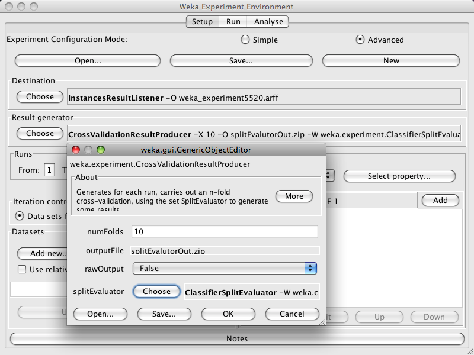
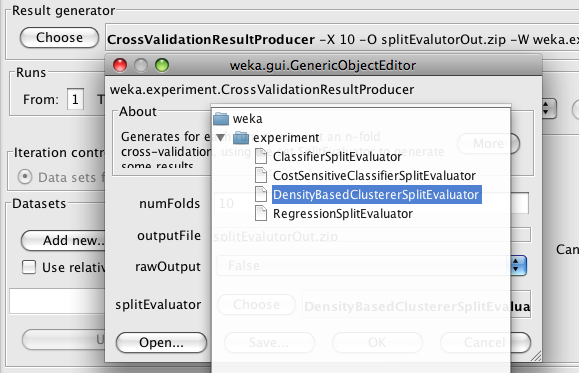
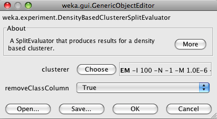
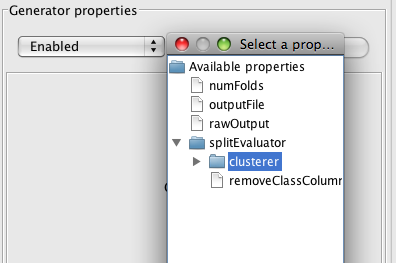
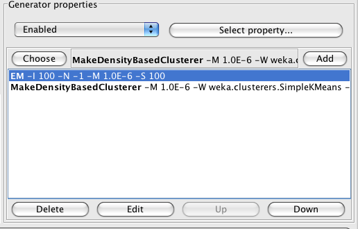
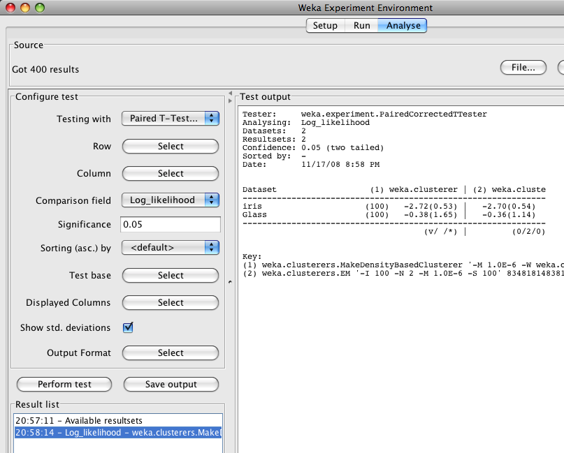

Using the advanced mode of the Experimenter you can now run experiments on clustering algorithms as well as classifiers (Note: 
this is a new feature available with Weka 3.5.8). The main evaluation metric for this type of experiment is the log likelihood of the clusters found by each clusterer. Here is an example of setting up a cross-validation experiment using clusterers.

Choose *CrossValidationResultProducer* from the *Result generator* panel.

Next, choose *DensityBasedClustererSplitEvaluator* as the split evaluator to use.

If you click on *DensityBasedClustererSplitEvaluator* you will see its options. **Note** that there is an option for removing the class column from the data. In the Experimenter, the class column is set to be the last column by default. Turn this off if you want to keep this column in the data.

Once *DensityBasedClustererSplitEvaluator* has been selected, you will notice that the *Generator properties* have become disabled. Enable them again and expand *splitEvaluator*. Select the *clusterer* node.

Now you will see that *EM* becomes the default clusterer and gets added to the list of schemes. You can now add/delete other clusterers. 

**IMPORTANT**: in order to any clusterer that does not produce density estimates (i.e. most other clusterers in Weka), they will have to wrapped in the *MakeDensityBasedClusterer*.

Once and experiment has been run, you can analyze results in the *Analyse* panel. In the *Comparison field* you will need to scroll down and select "Log_likelihood".

