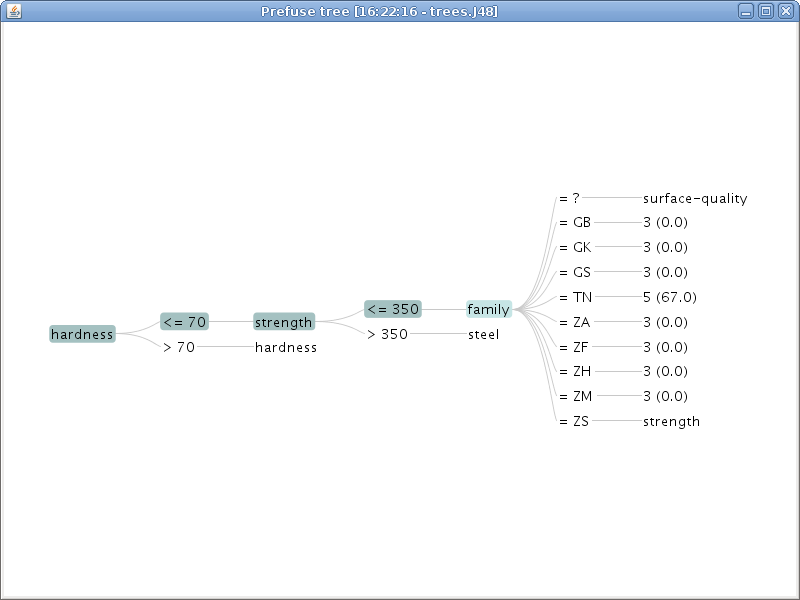
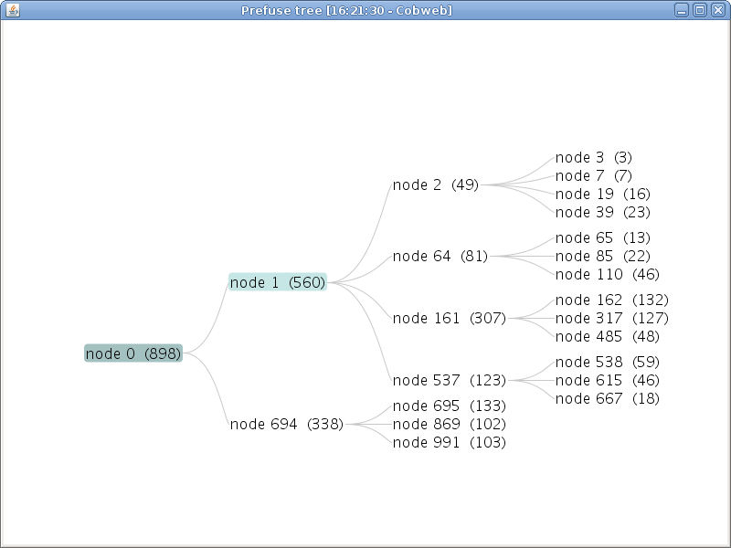

# Introduction
As of Weka version >3.5.8 (only developer version, not stable-3.6 branch) one can easily add tree visualization plugins in the Explorer (Classify and Cluster panel). This makes it easy to implement custom visualizations, if the ones Weka offers are not sufficient.

**Note:** This is also covered in chapter *Extending WEKA* of the WEKA manual in versions later than 3.7.0 or [snapshots](../snapshots.md) of the developer version later than 10/01/2010.

*tree* is referring to trees generated, for instance, by the `weka.classifiers.trees.J48` classifier. To be more precise, all classes that import the `weka.core.Drawable` interface and which `graphType()` method returns `weka.core.Drawable.TREE`. This means, that the trees the clusterer `weka.clusterers.Cobweb` generates, can be displayed as well.

# Requirements
* custom visualization class must implement the following **interface**
> `weka.gui.visualize.plugins.TreeVisualizePlugin`
* the class must **either** reside in the following **package** (visualization classes are automatically discovered during run-time)
> `weka.gui.visualize.plugins`
* or the class' package must be listed in the `weka.gui.visualize.plugins.TreeVisualizePlugin` key of the `[weka/gui/GenericPropertiesCreator.props](weka_gui_genericpropertiescreator.props.md)` file.

# Implementation
The visualization interface contains the following four methods

* **getMinVersion**
> This method returns the *minimal* version (inclusive) of Weka that is necessary to execute the plugin, e.g., `3.5.0`.
* **getMaxVersion**
> This method returns the *maximal* version (exclusive) of Weka that is necessary to execute the plugin, e.g., `3.6.0`.
* **getDesignVersion**
> Returns the actual version of Weka this plugin was designed for, e.g., `3.5.1`
* **getVisualizeMenuItem**
> The `JMenuItem` that is returned via this method will be added to the plugins menu in the popup in the Explorer. The ActionListener for clicking the menu item will most likely open a new frame containing the visualized data.

# Examples
## prefuse visualization toolkit
The [PrefuseTree.java](../files/PrefuseTree.java). It is based on the `prefuse.demos.TreeView` demo class.

The following screenshot was generated using *J48* on the UCI dataset *anneal* with default parameters:

And here is an example of *Cobweb* on the same dataset, once again with default parameters:

**Note:** Both trees are only partially displayed, since the prefuse tree component offers *exploration* of the loaded tree.

# Downloads
* [PrefuseTree.java](../files/PrefuseTree.java)

# See also
* [Use Weka in your Java code](../use_weka_in_your_java_code.md) - general overview of the basic Weka API
* [Explorer visualization plugins](explorer_visualization_plugins.md)

# Links
* [Prefuse homepage](http://prefuse.org/)
* [PAP - prefuse assistance pool](http://goosebumps4all.net/34all/bb/forumdisplay.php?fid=18)
