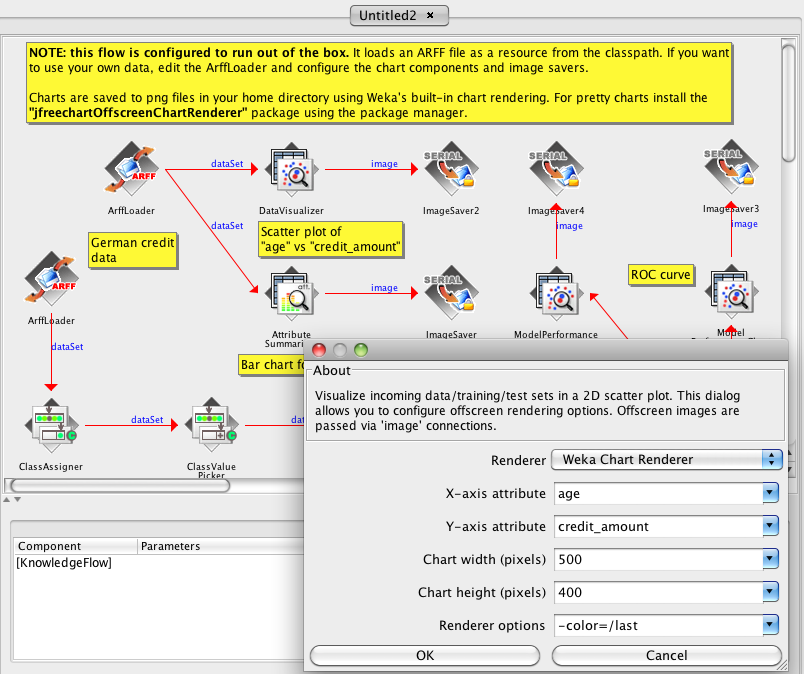
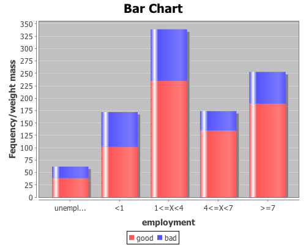
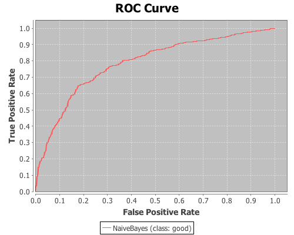
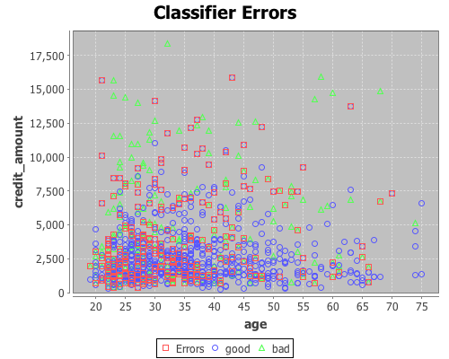
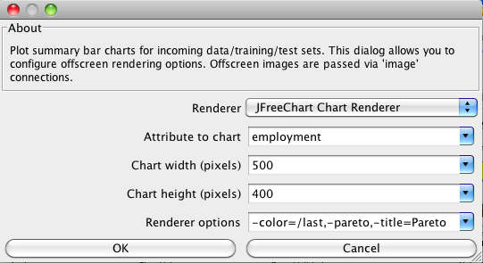
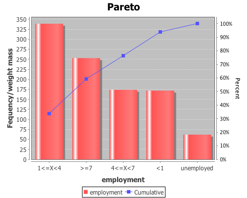

From Weka 3.7.5 it is possible to create and save charts such as scatter plots, attribute histograms, error plots, ROC curves etc. non-interactively as part of a data mining process. Weka's built-in charts can be used or an optional package, such as `jfreechartOffscreenChartRenderer` (to be released in conjunction with Weka 3.7.5) can be installed using the package manager in order to render pretty charts using the [JFreeChart library](http://www.jfree.org/jfreechart/). A new template is included in the Knowledge Flow that can be used to get you started and demonstrate the options available.

The above example Knowledge Flow uses the german credit data from the UCI repository and is configured to use the built-in Weka charting routines. The "*ImageSaver*" components are configured to save the generated PNG charts to the user's home directory (any writable place on the filesystem can be used of course). Tool tips appear when the mouse hovers over the labels of the options for the renderer in the configuration dialog for the "*DataVisualizer*", "*AttributeSummarizer*" and "*ModelPerformanceChart*" components that explain the available options. The following screenshots show the charts that are generated by the flow using using the optional `jfreechartOffscreenChartRenderer` package:

| | |
| ---      | ---       |
|  |  |
|  |  |

Version 1.0.1 of the `jfreechartOffscreenChartRenderer` adds the ability to plot a Pareto chart for nominal attributes. The `-pareto` renderer option can be used to accomplish this.

| | |
| ---      | ---       |
|   |   |
